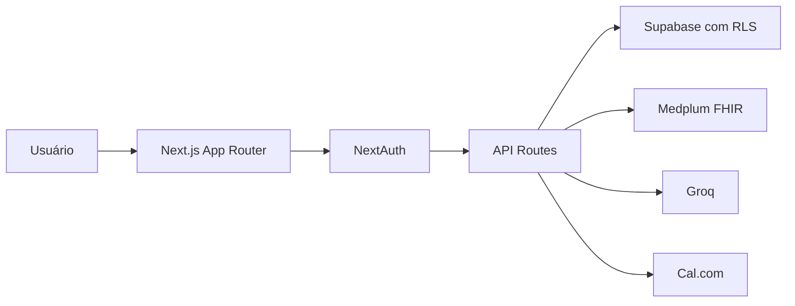

# Arquitetura do Software — MenteSolidária

## Visão geral

A aplicação utiliza Next.js 15 (App Router), TypeScript estrito e separação por camadas para manter escalabilidade, segurança e compliance LGPD.

## Camadas

- **Apresentação**: páginas em `app/` e componentes em `components/`.
- **API Routes**: entrada server-side com validação, autenticação e respostas JSON padronizadas.
- **Serviços (`lib/`)**:
  - `lib/auth`: autenticação e guards.
  - `lib/supabase`: acesso a dados e políticas de persistência com fallback para `db.json`.
  - `lib/lgpd`: consentimento e versionamento de termos.
  - `lib/groq`: acolhimento e triagem assistida por IA.
  - `lib/calcom`: disponibilidade e agendamentos.
  - `lib/notificacoes`: envio de e-mail e WhatsApp.
  - `lib/audit`: logging de acesso.
- **Persistência**:
  - Primária: Supabase (RLS).
  - Fallback MVP: `data/db.json` quando `USE_SUPABASE=false`.

## Fluxo de dados principal

1. Usuário autentica via NextAuth (Credentials/Google).
2. API Route valida sessão e perfil.
3. Dados operacionais são processados em serviços (`lib/*`).
4. Persistência ocorre no Supabase com RLS (ou fallback local para MVP).
5. Dados clínicos estruturados seguem integração FHIR via Medplum.
